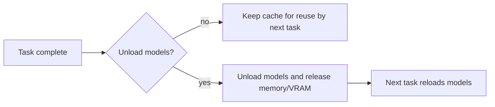

# General and Application Settings

This guide covers the settings page’s “General” group and the application state it carries. It documents general processing switches, the custom API-parameter file switch, the filter list, global mask parameters, model unloading, automatic shutdown after translation, and editor preferences; specialized detection, OCR, translation, inpainting, typesetting, upscaling, and colorization parameters belong to their respective pages.

## Change it in the desktop app {#ui-operations}

Open Settings and select “General”. Dynamic rows are generated from storage keys in the layout file; clicking a row shows its description in the right-hand description panel. Changing a toggle, number, or combo box updates the configuration immediately, after which the configuration service coalesces the disk write. Language, theme, update checks, and the automatic-update preference are managed on the About Application page.

The “Use Custom API Params” row includes an “Edit” button that opens `config/custom_api_params.json`; this is a file-edit action, not JSON embedded in `AppSettings`. The filter-list row includes an “Edit Filter List” button for the filter-word file. The font-directory button is in Typesetting, not this page.

### Application preferences and updates

Open About Application from the main navigation to change the interface language and theme. “Use System Proxy” routes API tests, translation, OCR, AI rendering, and AI colorization through the proxy selected by the operating system; PAC and bypass rules are resolved for each request URL. It takes effect immediately and does not overwrite Git's own proxy configuration. The same page contains “Automatically check for updates”, “Check for Updates”, and a release dialog. The check reads the latest GitHub release without blocking the UI. “Update Now” starts the existing `Win-Install-or-Update.bat` / `packaging/launch.py --maintenance` workflow; the app closes after the handoff. The “Support the Project” entry at the bottom shows WeChat and Alipay QR codes and provides a Ko-fi link for international supporters.

The API preset toolbar displays the current API preset. Switching a preset refreshes API forms and credential slots; it does not change the translator or detector implementation. The current preset name is stored in `app.current_preset` and is application state rather than a normal dynamic settings row. The editor property panel stores its OCR and translator choices separately as `app.editor_ocr` and `app.editor_translator`, defaulting to `mocr` and `openai`; these do not follow or overwrite homepage `ocr.ocr` and `translator.translator`. Target language remains shared through `translator.target_lang`.

## Parameters

> For the mapping of UI names, storage keys, and default values of the parameters on this page, see the [Settings Parameter Index](../../reference/settings-index.md).

### Use Custom API Params {#custom-api-params}

The “Use Custom API Params” toggle is on Settings → General. When enabled, `config/custom_api_params.json` is read; presets are matched by the current request’s model name and `common` is merged with the corresponding API module section to attach extra request parameters for translation, AI OCR, AI rendering, and AI colorization. The adjacent `Edit` button opens that JSON file. It does not store keys, bases, or models and does not perform API candidate rotation.

Default: `true`.

See [Custom Request Parameters](../api-management/custom-request-parameters.md) for details.

### Unload Models After Translation {#unload-models}

The “Unload Models After Translation” toggle is on Settings → General. When enabled, the desktop unloads models after each image/task completes, releasing memory and VRAM; the next task reloads models on demand. It helps under low VRAM but adds loading time to the next task.

Default: `false`.

### Shut Down Computer After Translation {#shutdown-after-translation}

The “Shut Down Computer After Translation” toggle is on Settings → General and is off by default. When enabled, the desktop schedules the computer to shut down 60 seconds after a batch completes successfully and background cleanup is idle. The grace period allows result writes to finish and leaves time to cancel a pending shutdown. Manual stops, batch-level errors, and individual file failures do not trigger it. If system permissions or the shutdown command are unavailable, the app logs a warning and remains open.

Windows uses `shutdown /s /t 60`; Linux/macOS use the platform’s supported delayed-shutdown command. This setting only affects desktop translation batches; it does not change the lifecycle of the CLI or remote services.

Default: `false`.

### Enable Filter List {#filter-text-enabled}

The “Enable Filter List” toggle is on Settings → General and has an “Edit Filter List” button. When enabled, an OCR result that matches a filter word (exact/contains rules, case-insensitive) skips that text region; the filter-word file is maintained by the filter-list editor. Default: `false`.

### Kernel Size {#kernel-size}

“Kernel Size” is an integer input that controls the convolution kernel used for mask cleanup before inpainting; an excessive value can damage line art. Default: `3`.

### Mask Dilation Offset {#mask-dilation-offset}

“Mask Dilation Offset” is an integer input that controls how many pixels the text mask expands to cover residual source pixels; `0` means no extra expansion, and bubble constraints are further limited by dedicated OCR/Inpainting options. Default: `50`.

## Runtime behavior and configuration lifecycle {#runtime}

The settings page builds dynamic controls from `ConfigService.get_config().model_dump()`. Each control change is sent through `MainAppLogic.update_single_config()` to the Pydantic `AppSettings`; translator and target-language changes additionally refresh the translation service, while `render.*` emits an editor-refresh signal. Language and theme use dedicated signals: language reloads locale/Qt translators, and theme reapplies styling.

At startup, the priority is code `AppSettings` defaults < the release template such as `config/config-example.json` < user `config/config.json`. The user configuration is synchronized with added/removed template keys. Ordinary settings are persisted to `config/config.json`; the service coalesces writes with a 250 ms debounce, while explicit save/switch operations flush pending writes. Explicit CLI arguments override `cli.*` only at the CLI entry point; an omitted argument is not an override.

General’s GPU, ONNX, batch, output, and retry settings ultimately enter core `Config.cli`; the CLI/batch page owns their complete workflow and concurrency explanation, while this page records their General controls and boundaries.

## Interactions and caveats {#dependencies}

- `cli.use_gpu` requires matching CUDA/hardware dependencies; `cli.disable_onnx_gpu` can disable only the ONNX GPU backend, so the two switches are not mutually exclusive.
- `cli.batch_concurrent` is constrained by special inputs/workflows and resource conditions; it does not guarantee simultaneous execution of every model or API request.
- `cli.export_editable_psd` requires Photoshop; with `cli.psd_script_only`, only the script is produced and a PSD must not be claimed.
- `use_custom_api_params` requires parseable JSON and a matching model configuration; it is separate from `.env` credentials, API bases, and API slot rotation.
- Excessive `mask_dilation_offset` or `kernel_size` can consume line art and balloon borders; bubble-mask limits require the OCR/Inpainting settings.
- Unloading models reduces resident VRAM but costs the next task’s load time; it does not guarantee that third-party processes immediately return all memory.
