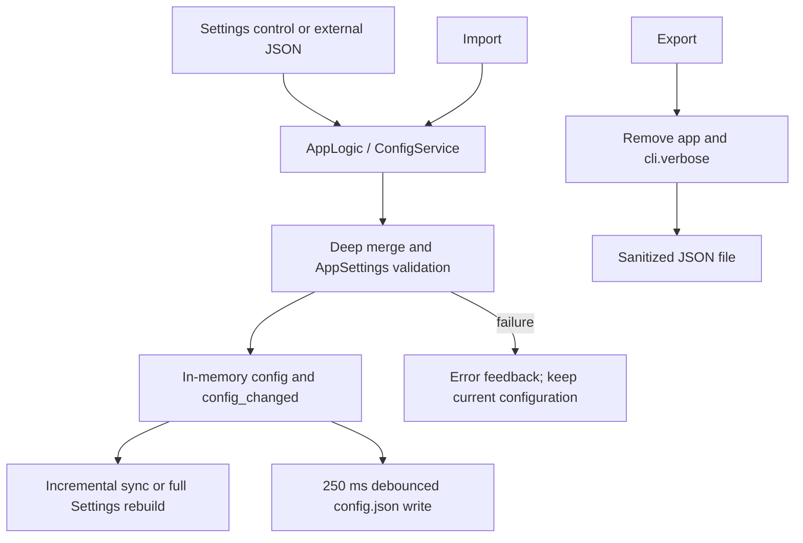

# Settings Shell, Descriptions, and Config Import/Export

This guide describes how the desktop Settings page organizes groups, parameter rows, and the right-hand description panel, and how it exports or imports settings JSON. It does not explain the algorithmic meaning of detection, OCR, translation, inpainting, typesetting, upscaling, or colorization parameters; those belong in the [Settings Parameter Index](../../reference/settings-index.md) and the corresponding parameter pages. It also does not own API credential slots, presets, prompt lists, or editor project files.

## What these settings control {#feature-boundary}

- The Settings shell consists of a header, seven group tabs, a scrollable parameter list, and a right-hand description panel; the header also provides “Export Config” and “Import Config”.
- `settings_tab_layout.json` currently defines seven tabs: `General`, `OCR`, `Detection`, `Translation`, `Inpainting`, `Typesetting`, and `Mode Specific`. `Advanced`, `Replace Translation`, `Upscaling`, and `Colorization` are dividers inside tabs, not independent tabs.
- The dynamic settings code skips internal state, workflow-controlled fields, and deprecated fields. The Phase 0 inventory has 112 layout entries and 111 visible parameters; the entry count must not be presented as the number of visible rows.
- Export handles a JSON snapshot of the settings model and explicitly removes the temporary `app` state and `cli.verbose`; it is not an API-credential or whole-work-directory backup.
- Import deep-merges external JSON into the current settings, restores the current `app` section, and validates through `AppSettings`; it does not import `.env`, prompt contents, translation JSON, or user images.

## Change it in the desktop app {#ui-operations}

### Settings shell and right-hand description {#settings-shell}

1. Open the desktop Settings page. The header shows the title and automatic-save hint, with configuration import/export buttons on the right.
2. Select a group tab. Rows are rebuilt in the order of `items` in `settings_tab_layout.json`; dividers only change visual grouping.
3. Change a toggle, input, or combo box. Ordinary edits update the in-memory configuration immediately and are then coalesced to disk by the configuration service; there is no separate Apply button.
4. Click a row, label, or its control. The right-hand “Parameter Description” panel shows the row name, a formatted configuration key, and the matching `desc_<section>_<key>` description. If no description exists, it shows “No description available.”
5. Clearing an optional numeric input or entering an unparseable number emits `null`; consumers interpret that as default/automatic semantics. An empty value is not saved as an empty numeric string.

### File-edit actions are not ordinary parameters {#file-edit-actions}

These rows remain in Settings, but their buttons open a resource editor or directory rather than placing file contents in an ordinary configuration value.

The dedicated prompt pages document each prompt format and consumer; this page records only the Settings-shell action boundary.

### Export configuration {#export-config}

1. Click “Export Config” (`Export Config`).
2. In the native save dialog, choose a destination. The code supplies `manga_translator_config.json` as the default filename and filters for `JSON Files (*.json)`.
3. Canceling the dialog writes nothing and shows no success message.
4. On success, the UI shows “Export Success” and a sanitization note; on failure, it shows “Export Failed” with the error.

The snapshot starts from `AppSettings.model_dump()`. Before writing, export deletes the complete `app` section and removes `verbose` from `cli`; the exported JSON therefore does not contain application paths, favorites, current preset, or API keys. It may still contain non-credential pipeline parameters, so inspect it before sharing.

### Import configuration {#import-config}

1. Click “Import Config” (`Import Config`).
2. In the native open dialog, select a `JSON Files (*.json)` file; canceling leaves the current configuration unchanged.
3. The file is read as UTF-8 JSON and deep-merged into the current configuration.
4. The current `app` section is restored after the merge, so the imported file cannot replace local paths, theme, language, or other application state.
5. After `AppSettings.model_validate()` succeeds, the service updates memory, requests a save, and notifies the UI. The Settings page may rebuild, refreshing the description panel, API groups, and prompt-related controls.
6. Success shows “Import Success” and explicitly says that current API keys and sensitive information were preserved; parse, validation, or save errors show “Import Failed”.

The code has no dedicated “confirm overwrite” dialog for configuration import; import directly merges and saves. Whether the native save dialog asks before replacing an existing target is only statically known and has not been confirmed in headed runtime, so it must not be documented as an application guarantee.

## How the settings take effect {#runtime-behavior}

Normal setting events update `AppSettings` and notify UI listeners. At startup, `ConfigService` loads with precedence user config > default template > `AppSettings` code defaults. The import function starts from the current in-memory snapshot, deep-merges external keys, restores `app`, and then performs full Pydantic validation. Unknown keys do not create new setting rows; invalid external JSON must not be treated as trusted configuration.

Normal saves use a 250 ms debounce, a single writer, a temporary file, and atomic `os.replace`; explicit file saves flush. The import/export buttons connect to `AppLogic.export_config` and `AppLogic.import_config`, rather than making the Settings page read and write files directly.

## Interactions and caveats {#dependencies-and-conflicts}

- Imported files must be readable UTF-8 JSON. Syntax errors, type errors, or model violations can fail import or cause relevant values to fall back to defaults.
- Import does not update `.env` and cannot replace `app`; API credentials remain within the API-management dotenv boundary. Do not treat exported JSON as a credential backup.
- Ordinary edits depend on `AppSettings`, Pydantic validation, and the configuration writer. Pending writes or hand edits during shutdown can overwrite manual changes.
- Choosing a feature provider refreshes API sections; that is feature configuration linkage, not API candidate-slot rotation. Rotation belongs to API-management pages.
- File-edit actions depend on their resource files and editors. Prompt, filter-list, and font-directory actions are not ordinary setting values.
- After successful import, dynamic controls can be rebuilt and API groups and the description panel can briefly refresh; do not repeatedly edit a row during reconstruction.

## Config file format {#config-file-format}

- `config/config-example.json` is the distribution configuration template shipped with the app. It contains example defaults for every field group and is used to initialize the user configuration on first launch.
- `config/config.json` is the user configuration file the app actually reads and writes: Settings edits, config imports, and automatic saves all go here. If it does not exist on first launch, it is created from the distribution template, and newly added template keys are merged into the user configuration. This documentation does not show real user configuration, and the file must not hold private paths or credentials.
- Top-level fields are grouped by function: `app` (application state and preferences), `translator`, `ocr`, `detector`, `inpainter`, `render`, `upscale`, `colorizer`, and `cli` (command-line/batch/output); a few top-level switches such as `filter_text_enabled`, `kernel_size`, `mask_dilation_offset`, and `use_custom_api_params` live at the root.
- Load precedence: user configuration `config/config.json` > distribution template `config/config-example.json` > built-in defaults (the `AppSettings` / core `Config` code defaults). Each loaded layer overrides the previous one key by key; a missing or invalid key falls back to a lower-precedence default.
