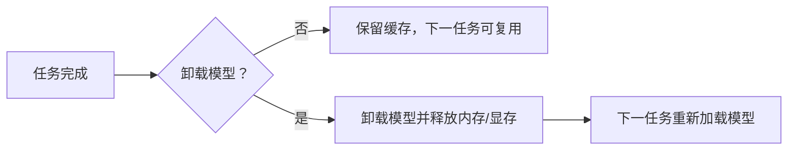

# 通用与应用设置

本页对应设置页的 “General” 分组，以及它所承载的应用级状态和通用处理开关。它负责通用处理开关、API 参数文件开关、过滤列表、全局蒙版参数、模型卸载、翻译完成后自动关机和编辑器偏好；检测、OCR、翻译、修复、排版、超分和上色的专用参数分别见对应设置页。

## 在桌面端修改 {#ui-operations}

打开设置页并选择 “General”。动态设置行由布局文件中的存储键生成，点击一行会在右侧说明面板显示该键的说明。修改开关、数值或下拉框后，配置立即更新；配置服务随后合并写盘。语言、主题、更新检查和自动检查更新开关统一位于“关于应用”页面。

“Use Custom API Params” 旁边的 “Edit” 按钮打开 `config/custom_api_params.json` 编辑器；它是文件编辑动作，不是把 JSON 内容嵌入 `AppSettings`。过滤列表的 “Edit Filter List” 按钮编辑过滤词文件。字体目录按钮位于 Typesetting，不属于本页。

### 应用偏好与更新

从主页导航打开“关于应用”，可以切换界面语言和主题；“使用系统代理”会让 API 测试、翻译、OCR、AI 渲染和 AI 上色使用操作系统选出的代理，并按每个请求地址分别匹配 PAC 与绕过规则。开关立即生效，但不会覆盖 Git 自己的代理配置。该页面还提供“自动检查更新”“检查更新”和版本更新弹窗。检查更新在后台读取 GitHub 最新发布版本，不阻塞界面；点击“立即更新”会启动现有的 `Win-Install-or-Update.bat` / `packaging/launch.py --maintenance` 流程，交接后关闭应用。页面底部的“赞助项目”入口会显示微信、支付宝二维码，并提供海外 Ko-fi 链接。

API 预设工具栏显示当前 API 预设；切换预设会刷新 API 表单和凭据槽，不改变翻译器/检测器等核心实现。当前预设名称保存在 `app.current_preset`，是应用状态而非普通动态设置行。编辑器属性面板的 OCR 与翻译器选择另存为 `app.editor_ocr` 与 `app.editor_translator`，默认分别为 `mocr` 与 `openai`，因此不会跟随或改写主页的 `ocr.ocr` 与 `translator.translator`；目标语言仍共享 `translator.target_lang`。

## 参数

> 本页各参数的界面名称、存储键与默认值的对应关系，见[设置参数索引](../../reference/settings-index.md)。

### 使用自定义API参数 {#custom-api-params}

“使用自定义API参数”开关位于“设置 → General”，开启后读取 `config/custom_api_params.json`，按当前请求的模型名匹配预设并合并 `common` 与对应 API 模块分组，为翻译、AI OCR、AI 渲染和 AI 上色请求附加额外参数；旁边的 `Edit` 按钮打开该 JSON 文件。它不保存 Key、Base、Model，也不参与 API 候选槽轮换。

默认值：`true`。

详细说明见[自定义请求参数](../api-management/custom-request-parameters.md)。

### 翻译完成后卸载模型 {#unload-models}

“翻译完成后卸载模型”开关位于“设置 → General”。开启后，桌面端在每张图/任务完成后主动卸载模型，释放内存和显存；下次任务按需重新加载。低显存时有助于降低常驻占用，但会增加下一任务的加载时间。

默认值：`false`。

### 翻译完成后自动关机 {#shutdown-after-translation}

“翻译完成后自动关机”开关位于“设置 → General”，默认关闭。开启后，桌面端在一个批次至少成功保存一个新文件、没有失败文件且后台清理任务空闲后，使用系统关机命令安排电脑在 60 秒后关机；全部输入文件都被跳过时不会触发。这段缓冲时间用于保存结果，并留出取消待执行关机的时间。手动停止、批次级错误或单个文件失败时不会触发。如果系统权限不足或关机命令不可用，应用会记录警告并保持打开。

如果关机已经排程，关闭此开关、开始新批次或点击停止会尝试撤销待执行关机。Windows 使用 `shutdown /s /t 60` 并通过 `shutdown /a` 撤销；Linux/macOS 使用系统支持的延时关机和取消命令。此设置只影响桌面端翻译批次，不会改变 CLI 或远程服务的生命周期。

默认值：`false`。

### 启用过滤列表 {#filter-text-enabled}

“启用过滤列表”开关位于“设置 → General”，带有“编辑过滤列表”按钮。开启后，OCR 结果命中过滤词（精确/包含规则，大小写不敏感）时跳过对应文本区域；过滤词文件由过滤列表编辑器维护。默认值：`false`。

### 卷积核大小 {#kernel-size}

“卷积核大小”是整数输入框。它控制蒙版清理使用的卷积核大小，属于修复前蒙版阶段；值过大可能损伤线稿。默认值：`3`。

### 遮罩扩张偏移 {#mask-dilation-offset}

“遮罩扩张偏移”是整数输入框。它控制文字蒙版向外扩张的像素数，以覆盖残留像素；`0` 表示不额外外扩，气泡约束由 Inpainting/OCR 专用开关进一步限制。默认值：`50`。

## 运行机理与配置生命周期 {#runtime}

设置页从 `ConfigService.get_config().model_dump()` 构建动态控件。每次控件变化经 `MainAppLogic.update_single_config()` 写回 Pydantic `AppSettings`；翻译器和目标语言会额外刷新翻译服务，`render.*` 会发出编辑器刷新信号。语言和主题使用专用信号，因此语言会重载 locale/Qt translator，主题会重设样式。

启动时配置优先级是：代码 `AppSettings` 默认 < `config/config-example.json` 等发行默认模板 < 用户 `config/config.json`。用户配置会按默认模板同步新增/删除键。普通设置写入 `config/config.json`；配置服务使用 250 ms 防抖合并写入，显式保存/切换操作会刷新待写队列。命令行显式参数只在 CLI 入口覆盖 `cli.*`，没有传入的参数不会被声称为覆盖。

General 页的 GPU、ONNX、批量、输出和重试设置最终进入核心 `Config.cli`；CLI/批处理页面负责这些字段的完整工作流和并发说明，这里仅记录它们在 General 中的控件与边界。

## 搭配使用时的注意事项 {#dependencies}

- `cli.use_gpu` 需要匹配的 CUDA/硬件依赖；`cli.disable_onnx_gpu` 可单独关闭 ONNX GPU 后端，二者不是互斥开关。
- `cli.batch_concurrent` 受特殊输入/工作流和资源条件限制，不能保证所有模型或 API 请求同时执行。
- `cli.export_editable_psd` 需要 Photoshop；`cli.psd_script_only` 与它配合时只产生脚本，不能宣称已生成 PSD。
- `use_custom_api_params` 依赖可解析的 JSON 和匹配的模型配置；它与 `.env` 凭据、API Base、API 槽轮换分离。
- `mask_dilation_offset` 与 `kernel_size` 过大可能吞掉线稿、气泡边框；气泡蒙版限制需在 Inpainting/OCR 参数页配合验证。
- 开启卸载模型会降低常驻显存但牺牲下一任务的加载速度；它不保证第三方进程显存立即归还。
