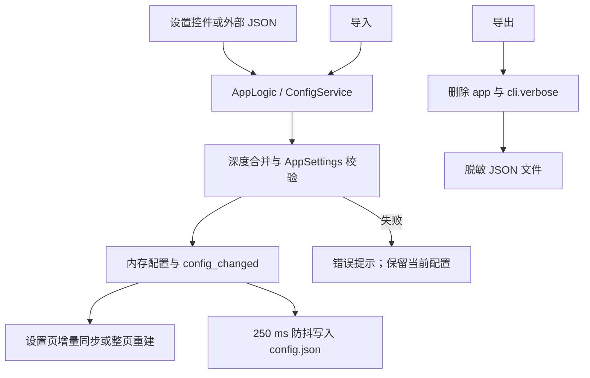

# 设置外壳、说明面板与配置导入导出

这里说明桌面端设置页如何组织分组、参数行和右侧说明，以及如何导出或导入设置 JSON。它不解释各检测、OCR、翻译、修复、排版、超分或上色参数的算法意义；这些内容见[设置参数索引](../../reference/settings-index.md)及对应参数页。本页也不负责 API 凭据槽、预设管理、提示词列表或编辑器项目文件。

## 这组设置控制什么 {#feature-boundary}

- 设置页外壳由标题区、七个分组页签、可滚动参数列表、右侧说明面板组成；页首另有“导出配置”和“导入配置”。
- `settings_tab_layout.json` 当前定义 `General`、`OCR`、`Detection`、`Translation`、`Inpainting`、`Typesetting`、`Mode Specific` 七个页签。`Advanced`、`Replace Translation`、`Upscaling` 和 `Colorization` 是页签内分隔标题，不是独立页签。
- 动态设置代码会跳过内部状态、已由工作流选择器代替的字段和废弃字段；布局清单的 112 个条目中，Phase 0 统计为 111 个可见参数，不能把清单条目数当成屏幕行数。
- 配置导出只处理设置模型的 JSON 快照，并主动排除 `app` 临时状态和 `cli.verbose`；它不是 API 凭据或整个运行目录的备份。
- 配置导入把外部 JSON 深度合并到当前配置，保留当前 `app` 段，再由 `AppSettings` 校验；它不是导入 `.env`、提示词正文、翻译 JSON 或用户图片的功能。

## 在桌面端修改 {#ui-operations}

### 设置页外壳与右侧说明 {#settings-shell}

1. 打开桌面端“设置”页面。页首显示标题和自动保存提示，右侧显示配置导入/导出按钮。
2. 选择一个分组页签。参数行按 `settings_tab_layout.json` 中的 `items` 顺序重建；分隔线只改变视觉分组。
3. 修改开关、输入框或下拉框。普通修改立即更新内存配置，随后由配置服务合并写盘；没有单独的“应用”按钮。
4. 点击参数行、标签或其控件，右侧“参数说明”面板会显示该行名称、格式化后的配置键和对应 `desc_<section>_<key>` 说明。没有说明时显示“暂无说明。”。
5. 可选数值输入框清空或输入无法解析的数字时，设置事件写入 `null`，由消费者解释为默认/自动语义；这不是把空字符串保存成数字。

### 文件编辑动作不是普通参数 {#file-edit-actions}

这些行仍显示在设置页，但其按钮打开资源编辑器或目录，不把文件内容塞进普通配置值。

具体提示词格式和各自消费者留在提示词页面；这里仅记录设置页的调用边界。

### 导出配置 {#export-config}

1. 点击“导出配置”。
2. 在系统保存文件对话框中选择位置；代码提供默认文件名 `manga_translator_config.json`，文件过滤器为 `JSON Files (*.json)`。
3. 取消对话框不会写文件，也不会弹成功提示。
4. 成功后显示“导出成功”和脱敏提示；失败显示“导出失败”及错误信息。

导出快照来自当前 `AppSettings.model_dump()`。导出前删除整个 `app` 段，并从 `cli` 删除 `verbose`；因此导出的 JSON 不含应用路径、收藏夹、当前预设等临时状态，也不包含 API Key。导出文件可能仍包含非凭据的流程参数，分享前应人工检查。

### 导入配置 {#import-config}

1. 点击“导入配置”。
2. 在系统打开文件对话框中选择 `JSON Files (*.json)` 文件；取消则不改变当前配置。
3. 文件按 UTF-8 JSON 读取，并将导入字典深度合并到当前配置。
4. 当前 `app` 段在合并后恢复，因此导入文件不能覆盖本机路径、主题、语言和其他应用临时状态。
5. `AppSettings.model_validate()` 成功后立即更新内存、请求保存并通知 UI；设置页可能整页重建，右侧说明、API 分组和提示词相关控件随之刷新。
6. 成功显示“导入成功”，并明确提示当前 API Key 和敏感信息已保留；解析、校验或保存异常显示“导入失败”。

代码没有为配置导入实现独立的“覆盖确认”对话框；导入是直接合并并保存。保存文件对话框是否由操作系统针对已有目标文件询问覆盖，当前仅代码检查，未在桌面环境中确认，不能写成应用保证的确认步骤。

## 参数如何生效 {#runtime-behavior}

普通设置事件通过控制器更新 `AppSettings`，并触发 UI 监听者。配置服务启动时按“用户配置 > 默认模板 > `AppSettings` 代码默认”加载；导入函数则从当前内存快照开始，深度合并外部键，恢复 `app` 后再进行一次完整 Pydantic 校验。未知键不会自动产生新的设置行；校验失败会进入错误反馈，不应把未经验证的外部 JSON 当作可信配置。

普通保存使用 250 ms 防抖、单线程写入器、临时文件和 `os.replace` 原子替换；显式文件保存会 flush。导入/导出按钮本身连接到 `AppLogic.export_config` 和 `AppLogic.import_config`，而不是直接让设置页读写文件。

## 搭配使用时的注意事项 {#dependencies-and-conflicts}

- 导入文件必须是可读取的 UTF-8 JSON；语法错误、类型错误或违反模型约束会使导入失败或让相关值回退到默认值。
- 导入不会更新 `.env`，也不会覆盖 `app` 段；API 凭据仍由 API 管理的 dotenv 边界维护。不得把导出的 JSON 当作凭据备份。
- 普通设置变更依赖 `AppSettings`、Pydantic 校验和配置写入器；程序退出或外部手改期间的待写快照可能覆盖手改内容。
- 选择功能提供商后 API 区域会刷新，这是功能配置联动，不是 API 候选槽轮换；具体轮换见 API 管理页面。
- 文件编辑动作依赖对应资源文件和编辑器；提示词编辑器、过滤列表编辑器、字体目录动作不是普通设置值。
- 导入成功后动态控件重建可能短暂刷新 API 组和说明面板；不要在重建过程中重复编辑同一行。

## 配置文件格式 {#config-file-format}

- `config/config-example.json` 是随程序分发的发行配置模板，包含各字段组的示例默认值；首次启动时应用用它初始化用户的配置文件。
- `config/config.json` 是应用实际读写的用户配置文件：设置页修改、导入配置和自动保存都写在这里。首次启动若不存在该文件，会从发行模板复制生成；模板中新增的键也会合并进用户配置。文档不展示真实用户配置，也不应在该文件中放置私有路径或凭据。
- 顶层字段按功能分组：`app`（应用状态与偏好）、`translator`、`ocr`、`detector`、`inpainter`、`render`、`upscale`、`colorizer`、`cli`（命令行/批量/输出）；另有 `filter_text_enabled`、`kernel_size`、`mask_dilation_offset`、`use_custom_api_params` 等顶层开关。
- 加载优先级：用户配置 `config/config.json` > 发行模板 `config/config-example.json` > 程序内置默认值（`AppSettings` / 核心 `Config` 的代码默认）。后加载的层逐键覆盖先加载的值；某个键缺失或非法时回退到更低优先级的默认值。
